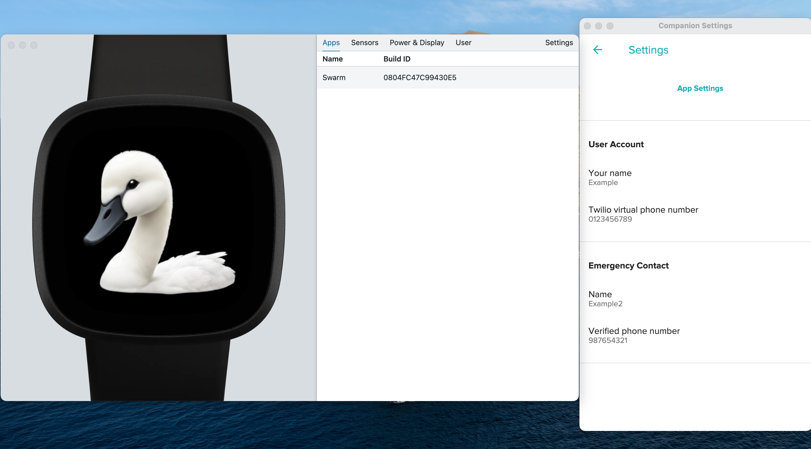

# swarm-fitbit-alarm

- Uses Fitbit SDK and Node
- Uses Twillio SMS API

## Set up backend, then fitbit-app
- Either run backend locally or deployed to Fly.io, following the [backend README](backend/README.md).
- Either run fitbit app in a simulator or on a real device, following the [fitbit-app/README](fitbit-app/README.md).

